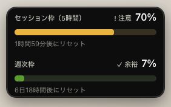
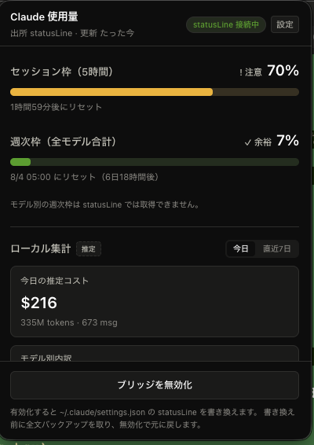

# Claude 使用量モニタ

Claude Code の使用量を、ブラウザで claude.ai を開かずに **メニューバーから常時確認**する macOS アプリ。

**メニューバー** — 消費率が常に見えます。色は 〜50% 緑 / 〜80% 橙 / 80%〜 赤。


**ミニウィンドウ** — デスクトップに置いておける小窓。ドラッグで移動できます。



**パネル** — メニューバーのアイコンをクリックすると開きます。下にスクロールすると
モデル別内訳・トークン内訳・直近7日のバーチャートが続きます。



見られるもの:

- **セッション枠**（5時間ローリングウィンドウ）の消費率とリセットまでの残り時間
- **週次枠**（全モデル合計）の消費率とリセット日時
- **今日 / 直近7日のトークン量と推定コスト**、モデル別内訳
- **直近7日の日次バーチャート**
- 80% / 95% を超えたときの**通知**

**完全ローカル動作。** 外部サーバへ送信する機能は一切ありません。

---

## 動作要件

| 項目 | 必要なもの |
|---|---|
| OS | macOS（Apple Silicon / arm64） |
| Claude Code | **v2.1.80 以降**（それ以前は使用量の情報が届きません） |
| 契約 | **Claude Pro / Max**（API キー認証では使用量が取得できません） |
| Node.js | **必須**（使用量を取り込むスクリプトの実行に使います） |

`node` が入っているかは、ターミナルで次を実行すれば分かります。

```sh
node --version
```

出てこない場合は [Node.js](https://nodejs.org/) を入れてください。

---

## インストール

現在は配布用のビルド済みファイルを公開していないので、自分でビルドします。

```sh
git clone https://github.com/hong8300/cc-usage-monitor.git
cd cc-usage-monitor
npm install
npm run dist:mac
```

`release/cc-usage-monitor-0.1.0-arm64.dmg` ができます。これを開いて、
**「Claude 使用量モニタ」を `Applications` フォルダにドラッグ**してください。

> **初回起動時に警告が出たら**
> このアプリは Apple の署名を付けていないため、ダブルクリックすると
> 「開発元を確認できないため開けません」と出ることがあります。
> **右クリック →「開く」** を選び、もう一度「開く」を押せば起動できます。
> 一度許可すれば次からは普通に開けます。

---

## 使い方

### 1. 初回だけ：ブリッジを有効化する

インストールしてアプリを起動すると、メニューバーに**灰色のリング**と `5h — · 7d —` が出ます。
まだ使用量が取れていない状態です。

1. メニューバーのアイコンを**クリック**してパネルを開く
2. 下の **「ブリッジを有効化」** ボタンを押す
3. Claude Code で何か1回やり取りする

これで使用量が流れ始めます。リングが色付きになり、数字が入ります。

> **「ブリッジ」とは**
> Claude Code には、画面下部の1行（statusLine）を自作スクリプトで表示する機能があります。
> このアプリはそこに小さな中継スクリプトを挟んで、Claude Code が渡してくる使用量情報を
> 受け取っています。有効化は `~/.claude/settings.json` の書き換えを伴いますが、
> **書き換える前に全文バックアップを取り、無効化すれば元に戻ります。**
> すでに statusLine を自分で設定している場合は、その表示を壊さずそのまま活かします。

### 2. 日常の使い方

| したいこと | 操作 |
|---|---|
| 詳しく見る | メニューバーのアイコンを**クリック** |
| 詳細パネルを出したままにする | パネル上部の **「表示を固定」** をクリック（「固定中」で有効）。右クリックメニューでも切り替え可 |
| 詳細パネルを移動 / 隠す | 見出しをドラッグ / メニューバーのアイコンをもう一度クリック |
| 常に見えるようにする | アイコンを**右クリック** →「ミニウィンドウを表示」 |
| 設定を変える | 右クリック →「設定…」、またはパネル右上の「設定」 |
| 使い方・Versionを確認する | アイコンを**右クリック** →「ヘルプ…」 |
| 終了する | 右クリック →「終了」 |

アプリのVersionは、詳細パネルの見出しにも常に表示されます。

**ミニウィンドウ**は 5時間枠と週次枠だけを出す小窓です。ドラッグで好きな位置に置けて、
位置は記憶されます。既定では他のアプリより手前に出続けます（設定で変更可）。

---

## 設定

パネル右上の「設定」から変更できます。

| 設定 | 既定 | 内容 |
|---|---|---|
| メニューバーの表示形式 | アイコン + % | 「% のみ」「アイコンのみ」も選べます |
| テーマ | システムに合わせる | ライト / ダーク固定も可 |
| パネルを表示したままにする | OFF | ON にすると、ほかの場所をクリックしても閉じません。上部の「表示を固定」と連動し、再起動後も設定を記憶します |
| **ミニウィンドウ** | | |
| デスクトップに常時表示 | OFF | 小窓の表示 / 非表示 |
| 常に最前面 | ON | 他アプリを全画面にしても手前に残ります |
| すべての操作スペースに表示 | OFF | Mission Control でデスクトップを切り替えても付いてきます |
| **通知** | | |
| 閾値通知 | ON | 消費率が閾値を超えたら通知します |
| 通知する消費率 | 80% / 95% | 70 / 80 / 90 / 95 から選べます |
| 対象の枠 | 両方 | 5時間枠 / 週次枠を個別に |
| **更新** | | |
| statusLine の再実行間隔 | 30秒 | 下記参照 |
| ローカル集計の再スキャン間隔 | 5分 | 通常は変更不要です |
| **起動** | | |
| ログイン時に自動起動 | OFF | ON にすると Mac 起動時に自動で立ち上がります |

> **「statusLine の再実行間隔」について**
> Claude Code は素のままだと、**操作したタイミングでしか** statusLine を実行しません。
> つまり「Claude Code は開いているが何もしていない」間は数字が止まったままになります。
> そこでこのアプリは既定で **30秒** を設定し、起動中は自動で更新されるようにしています。
> ブリッジを有効にすると `~/.claude/settings.json` の
> `statusLine.refreshInterval` に書き込まれます（無効化すれば元に戻ります）。
> 「設定しない」を選べば、Claude Code 本来の挙動（操作時のみ更新）に戻せます。

通知は**鳴りすぎないように**作られています。同じ枠・同じ閾値では1回だけ鳴り、
枠がリセットされると再び鳴るようになります。

---

## Mac を再起動したあとは？

**何もする必要はありません。** 設定の「ログイン時に自動起動」を ON にしておけば、
ログイン時にアプリが自動で立ち上がります。

仕組みとして、**データを集める部分と表示する部分は独立しています。**

- **データ収集**はアプリが起動していなくても動きます。Claude Code を使うたびに記録されるので、
  アプリを終了していた間の分も失われません。
- **アプリ**は、集まったデータを見るために必要です。起動すれば最新の状態が表示されます。

---

## アンインストール

1. パネル下部（または設定画面）の **「ブリッジを無効化」** を押す
   → `~/.claude/settings.json` が元に戻ります
2. アプリを終了する（右クリック →「終了」）
3. `Applications` から「Claude 使用量モニタ」をゴミ箱へ
4. 設定やバックアップも消す場合は `~/.cc-usage-monitor/` フォルダを削除

**順番が大切です。** ブリッジを無効化する前にアプリを消してしまうと、
`~/.claude/settings.json` に設定が残ります。その場合は手動で `statusLine` の項目を消すか、
`~/.cc-usage-monitor/backups/` にある日時付きのバックアップから戻してください。

---

## うまく動かないとき

**数字が `—` のまま**

- ブリッジを有効化しましたか？（パネル下部のボタン）
- 有効化したあと、Claude Code で1回やり取りしましたか？
  セッションを始めた直後はまだ使用量が届きません。
- `node --version` が動きますか？ Node.js が無いと取り込みができません。
- Claude Pro / Max 契約ですか？ API キー認証では使用量が提供されません。

**通知が来ない**

システム設定 →「通知」で「Claude 使用量モニタ」が許可されているか確認してください。

**メニューバーにアイコンが出ない**

メニューバーが混み合っていると隠れることがあります。他のアイコンを減らすか、
Command キーを押しながらドラッグして並び替えてみてください。

---

## 表示についての注意

**数字が取れない項目は `0%` ではなく `—` と表示します。** 「使っていない」のか
「取得できていない」のか区別できないと誤解のもとになるためです。マウスを乗せると理由が出ます。

取得できないことがあるのは、次のような場合です。

- Claude Code のセッションが動いていない（使用量は Claude Code 経由でしか届きません）
- セッションを始めた直後（最初のやり取りが終わるまで届きません）
- Claude Pro / Max 以外の契約
- **モデル別の週次枠は取得できません**（Claude Code からは提供されていないため）

5分以上古い数字は薄く表示されます。

**推定コストについて。** 「ローカル集計」に出る金額は、**同じ使用量を API で払った場合の概算**です。
Pro / Max の請求額でも、公式の枠消費率でもありません。Claude Code 自身の推定値と
突き合わせた実測では **2%程度の誤差**でした。区別のため「推定」バッジを付けています。

---

## 開発者向け

<details>
<summary>仕組み・開発コマンド・設計判断</summary>

### 仕組み

Claude Code の statusLine 機能は、ターン毎に JSON を stdin でスクリプトに渡す。
本アプリはこれを横取りしてファイルに落とし、監視して UI を更新する。

```
Claude Code ──stdin JSON──▶ ~/.cc-usage-monitor/bridge.js
                                   │
                                   ├──▶ ~/.cc-usage-monitor/latest.json（原子的書き込み）
                                   │            └──▶ アプリが chokidar で監視 → Tray / パネル
                                   │
                                   └──▶ 元の statusLine コマンドがあれば実行し stdout をパススルー
```

`bridge.js` は全処理を try/catch で包み、何が起きても必ず1行を stdout に出して正常終了する。
元コマンドが失敗・ハング（5秒でタイムアウト）しても既定行にフォールバックし、
エラーは `~/.cc-usage-monitor/bridge.log` に隔離して statusLine の出力は汚さない。

### `~/.claude/settings.json` の扱い

有効化時に **`statusLine` キーだけ**を書き換える。

- 書き換え前に全文バックアップ（`claude-settings.backup.json` + `backups/` に世代別）
- 既に別ツールの statusLine がある場合は「元コマンドを包む」形にし、stdout をパススルー
- 無効化で元の設定（`padding` などの付随設定含む）に戻す
- **有効化中にユーザーが他の設定を変更していても巻き戻さない**（`statusLine` 以外に触れないため）
- 他ツールの statusLine を勝手に削除しない

これらは `tests/bridge.test.ts` で実際にファイルを作って検証している。

### ローカル集計

`~/.claude/projects/**/*.jsonl` を**読み取り専用**で走査する。

- 重複排除は `message.id` + `requestId`。しないと総トークンを **+89.4% 過大計上**する（実測）
- キャッシュ書き込みは **5分 TTL (1.25x) と 1時間 TTL (2.0x) を分離**。
  一律 1.25x だと Claude Code 自身の推定に対して **−18.3%** ずれる（分離すると **−2.2%**）
- Batch（50%引き）、`inference_geo: "us"`（1.1x）、fast mode に対応
- `<synthetic>` / API エラー / `requestId` 欠損は除外
- サブエージェントの transcript も集計対象（親との ID 重複 0 件を確認済み）
- 価格表に無いモデルは 0 円にせず「価格不明」として UI に出す
- 常駐アプリなので**増分読み**（バイトオフセットを保持し追記分だけ読む）
- 監視するのは `.jsonl` のみ（`memory/*.md` などにはハンドルを持たない）

価格は `src/pricing.json` に分離（最終更新日と出典 URL 入り）。
`~/.cc-usage-monitor/pricing.json` を置けば**再ビルド無しで**上書きできる。

### コマンド

```sh
npm install
npm run dev         # 開発起動（ホットリロード）
npm run typecheck   # 型検査
npm test            # 回帰テスト（50件）
npm run build       # 本番ビルド
npm run icon        # build/icon.png を再生成
npm run dist:mac    # dmg を生成
```

アイコンはバイナリを直接置かず `scripts/generate-icon.ts` が生成する。

### 実機調査の記録

設計判断の根拠は [`docs/findings.md`](docs/findings.md) にある。
statusLine の実 JSON、`used_percentage` の浮動小数点誤差、
`model.id` の `[1m]` サフィックス、フィールドの明滅など、
公式ドキュメントだけでは分からなかった実測結果を記録している。

### 未実装

- **Windows 対応** — パスは `os.homedir()` ベースで解決しているが実機未検証
- **OAuth モード** — モデル別の週次枠を取得する非公開エンドポイントを使う案。
  公式ドキュメントに記載が無く、Anthropic の法務文書が OAuth 認証を
  「Claude Code および純正アプリ」に限定しているため、既定 OFF の
  明示オプトイン機能として保留。詳細は `docs/findings.md` §5
- **自動更新** — 更新時は `npm run dist:mac` して手動で `Applications` に上書き

</details>

---

## ライセンス

UNLICENSED（個人利用）。
